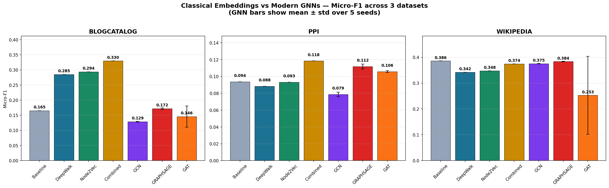
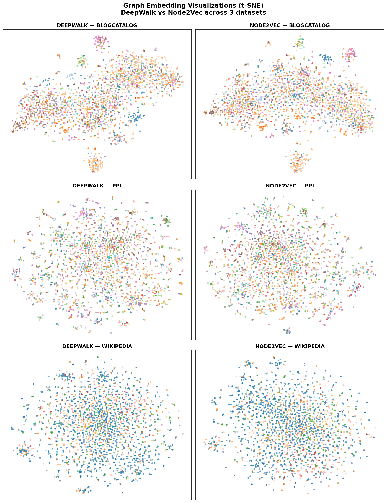

# Multi-Label Node Classification: Classical Embeddings vs Modern GNNs

> A comparative study of **7 graph learning methods** across **3 real-world datasets**, evaluating classical random-walk embeddings (DeepWalk, Node2Vec) against modern Graph Neural Networks (GCN, GraphSAGE, GAT) on accuracy, stability, and compute cost.


**Quick links:** [Key Finding](#tldr--key-finding) · [Results](#headline-results--accuracy) · [Compute](#compute--efficiency) · [Visualizations](#visualizations) · [Practical Takeaways](#practical-takeaways) · [Limitations](#limitations) · [Run it](#how-to-run)

*Skimming? The TL;DR and the two tables (Accuracy + Compute) tell the whole story in under a minute.*

---

## TL;DR — Key Finding

**On featureless benchmark graphs, random-walk embeddings consistently outperform feature-dependent GNN architectures.**

GCN, GraphSAGE, and GAT are designed to fuse *node features* with *graph structure*. The datasets used here (BlogCatalog, PPI, Wikipedia) provide no node features, so these GNNs operate at a structural disadvantage — while DeepWalk and Node2Vec, designed for featureless graphs, learn purely from connectivity and perform better.

A secondary finding: **under these featureless-graph conditions, GAT performed worst across all three axes simultaneously** — least accurate, least stable across seeds, and dramatically more expensive (up to 84× slower and 27× more memory than GraphSAGE). This is a concrete case against *standard GAT* for large featureless graphs — not a claim about attention in general, which remains effective on feature-rich graphs. The bottleneck here is per-edge attention cost combined with the absence of node features.

The broader point: *model choice should follow data characteristics, not architectural novelty.*

---

## Project Origin

This work began as **P15**, a graduate course project (SML, Arizona State University) implementing DeepWalk and Node2Vec from scratch for multi-label node classification. It was then extended into a comparative graph-learning study by adding modern GNN baselines (GCN, GraphSAGE, GAT), multi-seed evaluation, compute profiling, and embedding visualizations.

---

## Team & Contributions

The original P15 phase (datasets, DeepWalk, Node2Vec, classifiers, evaluation) was a 6-person team effort:

| Member | Role | Contribution |
|--------|------|--------------|
| **Harsha Koushik Teja Aila** | Team Lead | Graph embedding interface, integration pipeline, dataset verification, repo management, **GNN extension** |
| **Prashant Rathod** | Data Engineer | Dataset acquisition, graph construction, label processing, train/test splits |
| **Shaman Kanapathy** | DeepWalk Dev | DeepWalk from scratch — uniform walk generator, skip-gram training |
| **Priyanshu Gupta** | Node2Vec Dev | Node2Vec from scratch — biased walks, alias sampling, p/q tuning, combined model |
| **Aditya Khurana** | ML Engineer | Baseline & embedding classifiers, One-vs-Rest pipeline |
| **Sai Sagar Galli Raghu** | Eval & Viz | Evaluation metrics, result figures, comparison tables |

> The **GNN extension** (`src/gnn/`, `src/experiments/`) was developed individually as a continuation of the project.

---

## Headline Results — Accuracy

Micro-F1 across all 7 methods and 3 datasets. GNN values are **mean ± std over 5 seeds**; classical methods are single deterministic runs. Best per dataset in **bold**.

| Method | BlogCatalog | PPI | Wikipedia |
|--------|:-----------:|:---:|:---------:|
| Baseline (degree) | 0.1652 | 0.0937 | **0.3859** |
| DeepWalk | 0.2851 | 0.0882 | 0.3423 |
| Node2Vec | 0.2941 | 0.0932 | 0.3479 |
| **Combined (DW+N2V)** | **0.3298** | **0.1184** | 0.3744 |
| GCN | 0.1288 ± 0.001 | 0.0786 ± 0.003 | 0.3753 ± 0.001 |
| GraphSAGE | 0.1718 ± 0.003 | 0.1118 ± 0.003 | 0.3836 ± 0.001 |
| GAT | 0.1457 ± 0.035 | 0.1058 ± 0.001 | 0.2528 ± 0.151 |

**Observations:**
- The **Combined embedding** (DeepWalk + Node2Vec concatenated → 256-dim) is the strongest method on BlogCatalog and PPI.
- **GraphSAGE** is the best GNN across all datasets — neighborhood sampling handles featureless graphs better than convolution or attention.
- **GAT is unstable under these conditions**: high cross-seed variance (BlogCatalog ±0.035, Wikipedia ±0.151), with some seeds collapsing entirely. Attention coefficients are sensitive on sparse, featureless graphs, and the learnable node embedding adds optimization noise. This instability is visible only because of multi-seed evaluation — and would not necessarily appear on feature-rich graphs where GAT typically performs well.
- On **Wikipedia**, even the degree baseline is competitive, suggesting Part-of-Speech labels are more attribute-driven than structure-driven.

---

## Compute & Efficiency

Training time, parameter count, and peak GPU memory (1 representative run per model/dataset, hidden dim = 128, RTX 4050 6GB, early stopping enabled).

| Dataset | Model | Params | Epochs | Train Time | Peak GPU Mem |
|---------|-------|-------:|-------:|-----------:|-------------:|
| BlogCatalog | GCN | 1.34M | 300 | 13.2 s | 745 MB |
| BlogCatalog | GraphSAGE | 1.36M | 149 | **5.6 s** | **406 MB** |
| BlogCatalog | GAT | 1.49M | 164 | **468.6 s** | **10,816 MB** |
| PPI | GCN | 0.52M | 300 | 2.8 s | 113 MB |
| PPI | GraphSAGE | 0.54M | 116 | 0.8 s | 76 MB |
| PPI | GAT | 0.68M | 184 | 8.7 s | 1,302 MB |
| Wikipedia | GCN | 0.63M | 124 | 2.0 s | 227 MB |
| Wikipedia | GraphSAGE | 0.65M | 149 | 1.9 s | 134 MB |
| Wikipedia | GAT | 0.79M | 189 | 20.1 s | 3,044 MB |

**The GAT cost problem:** GAT computes attention coefficients per edge × 8 heads. On BlogCatalog (~668K directed edges) this required **84× more training time and 27× more memory than GraphSAGE** — exceeding the 6GB VRAM and spilling into shared memory. GAT memory scales directly with edge count (PPI 1.3 GB → Wikipedia 3.0 GB → BlogCatalog 10.8 GB), confirming the bottleneck is per-edge attention, not model size (parameter counts are nearly identical across the three GNNs).

**Takeaway:** GraphSAGE is the clear practical winner here — fastest, lightest, and the most accurate GNN. Under these featureless-graph conditions, standard GAT performed worst across accuracy, stability, and efficiency; this reflects the cost of per-edge attention on dense graphs without node features, not a general verdict on attention (GAT is competitive on feature-rich graphs such as citation networks).

---

## Visualizations

### Accuracy — Classical vs GNN


### Embedding Space (t-SNE) — DeepWalk vs Node2Vec


The t-SNE projections honestly reflect task difficulty: BlogCatalog shows partial cluster structure; PPI and Wikipedia embeddings are diffuse, consistent with their low Micro-F1 scores. The visualization confirms the numbers rather than contradicting them.

---

## Datasets

| Dataset | Type | Nodes | Edges | Classes |
|---------|------|------:|------:|--------:|
| BlogCatalog | Social network | 10,312 | 333,983 | 39 |
| PPI | Protein interaction | 3,852 | 37,841 | 50 |
| Wikipedia | Word co-occurrence | 4,777 | 92,295 | 40 |

All datasets use an 80/20 stratified train/test split — the standard benchmarks from the original DeepWalk and Node2Vec papers, ensuring comparability with published work. **None of these datasets include node features**, which is central to the main finding.

---

## Methods

**Classical (random-walk based):**
- **DeepWalk** — uniform random walks + Word2Vec skip-gram (gensim used for the skip-gram optimizer; walk generation implemented from scratch)
- **Node2Vec** — biased random walks with manually implemented alias sampling and p/q control
- **Combined** — concatenation of DeepWalk + Node2Vec embeddings (256-dim)
- **Baseline** — node degree + One-vs-Rest Logistic Regression

**Modern GNNs (PyTorch Geometric):**
- **GCN** — Graph Convolutional Network (Kipf & Welling, 2017)
- **GraphSAGE** — neighborhood aggregation (Hamilton et al., 2017)
- **GAT** — Graph Attention Network, 8 heads (Veličković et al., 2018)

All GNNs use a learnable node embedding (standard technique for featureless graphs), early stopping on a validation split, and a validation-tuned threshold for multi-label prediction.

---

## Practical Takeaways

When does each method make sense in practice?

- **Featureless graph, accuracy-critical** → DeepWalk/Node2Vec (or their concatenation). They are purpose-built for structure-only graphs and won here.
- **Need a GNN (e.g., to later add node features)** → GraphSAGE. It was the strongest and cheapest GNN and scales gracefully.
- **Large, dense graph + limited GPU** → avoid standard GAT. Per-edge attention memory makes it impractical here without substantial hardware, and the accuracy does not justify the cost on featureless graphs. (On feature-rich graphs the tradeoff can differ.)
- **Severe class imbalance (e.g., Wikipedia)** → always report Macro-F1 alongside Micro-F1; a strong Micro-F1 can hide poor minority-class performance, and a trivial baseline may look deceptively competitive.

The general lesson: on featureless graphs, architectural sophistication did not translate into better outcomes. Match the model to the data, not to the trend.

---

## Limitations

This is a focused comparative study, not an exhaustive benchmark. Specifically:

- **No extensive hyperparameter optimization.** Models use reasonable, paper-aligned defaults; per-dataset tuning (e.g., Optuna) was not performed and could shift GNN results upward.
- **Featureless datasets only.** The central finding is conditional on the absence of node features. On feature-rich graphs (e.g., Cora, Citeseer), GNNs would likely outperform — testing this is future work.
- **Limited dataset diversity.** Three datasets across three domains; broader coverage would strengthen generalization claims.
- **No inductive evaluation.** All experiments are transductive (test nodes seen during message passing); inductive generalization to unseen nodes was not measured.
- **Classical methods are single runs.** Only the GNNs have multi-seed statistics; DeepWalk/Node2Vec are deterministic given fixed walk seeds but were not re-seeded for variance estimates.

Stating these explicitly is intentional — the conclusions hold *within these bounds*, not beyond them.

---

## Project Structure

```
MultiLabel-NodeClassification/
├── data/processed/          # graphs (.gpickle), labels, train/test splits
├── src/
│   ├── deepwalk/            # DeepWalk implementation          [Shaman]
│   ├── node2vec/            # Node2Vec implementation          [Priyanshu]
│   ├── classification/      # baseline + embedding classifiers [Aditya]
│   ├── embeddings/          # unified BaseEmbedding interface  [Harsha]
│   ├── evaluation/          # metrics (Micro/Macro-F1, Hamming) [Sagar]
│   ├── gnn/                 # GCN/GraphSAGE/GAT, trainer, t-SNE [GNN ext.]
│   └── experiments/         # multi-seed runner + timing        [GNN ext.]
├── results/
│   ├── gnn/                 # GNN metrics, comparison CSV, timing JSON
│   └── visualizations/      # t-SNE grids, comparison charts
├── reports/                 # final written report
└── requirements.txt
```

---

## How to Run

```bash
# 1. Clone and set up environment
git clone https://github.com/HarshaKoushikTeja/MultiLabel-NodeClassification.git
cd MultiLabel-NodeClassification
python -m venv venv
source venv/Scripts/activate          # Windows: venv\Scripts\activate
pip install -r requirements.txt

# 2. (GPU) Install PyTorch + PyTorch Geometric with CUDA 12.1
pip install torch==2.3.0 --index-url https://download.pytorch.org/whl/cu121
pip install torch_geometric==2.5.3
pip install pyg_lib torch_scatter torch_sparse torch_cluster torch_spline_conv \
    -f https://data.pyg.org/whl/torch-2.3.0+cu121.html

# 3. Classical embeddings
python src/deepwalk/run_deepwalk.py
python src/classification/classifier.py

# 4. Full GNN benchmark (3 models x 3 datasets x 5 seeds)
python src/experiments/run_gnn_experiments.py

# 5. Compute profiling
python src/experiments/measure_timing.py

# 6. Visualizations
python src/gnn/visualize_tsne.py
python src/gnn/plot_comparison.py
```

---

## Future Work

- Add Cora/Citeseer (feature-rich citation networks) to test whether GNNs win when node features exist
- Per-dataset hyperparameter optimization with Optuna
- GNN depth ablation (over-smoothing analysis)
- Inductive evaluation (train on subgraph, test on unseen nodes)

---

## Tech Stack

`Python` · `PyTorch` · `PyTorch Geometric` · `NetworkX` · `scikit-learn` · `gensim` · `NumPy` · `Matplotlib` · `seaborn`

---

*Originally built as academic project P15 (SML, Arizona State University) and extended into a comparative graph representation learning study.*